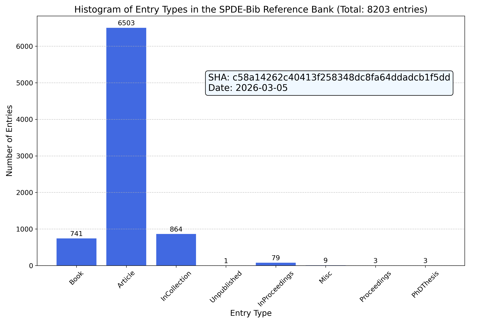

Introduction
============

Motivation
----------

When writing a paper, it is not an easy task to keep the bibliography part
correct and updated. This process is also very time-consuming. Through this
repo, we provide a uniform access to the latest bibliography entries related to
the research area of the author: *Stochastic Partial Differential Equations*
(SPDEs) and related fields.

Sources
-------

Here is a reference bank. The biblatex entries were mostly obtained from

.. centered:: `MathSciNet <https://mathscinet.ams.org/mathscinet>`_ : `https://mathscinet.ams.org/`

for the published mathematics papers and from the *arXiv* for
the preprint. Some physics papers are obtained from

.. centered:: `APS Journals <https://journals.aps.org/search/>`_ : `https://journals.aps.org/`

For papers that do not originate from the aforementioned sources, we
endeavor to retrieve the bibliography entry directly from the official journal
website to ensure maximum accuracy of the records. We also include many preprint
from the *arXiv*.

Status and Statistics
----------------------

The current statistics of the bibliography bank is shown in the following
figure:

Naming convention
-----------------

The naming convention consists of three makeup cases:

1. Single authored paper, such as:

   * Einstein, Albert. Random PDE for special relativities. *Annals of
     Probability*, Volume, Number, 2023.

   The cite key is ``einstein:23:random``. The first part ``einstein`` is the
   last name of the first author. The second part ``23`` is the last two digits
   of the publication year. The third part ``random`` is the first word of the
   title. To cite this reference, use

   .. code-block:: latex

      \cite{einstein:23:random}

2. Paper with two authors, such as:

   * Einstein, Albert and Grothendieck, Alexandre. A stochastic PDE model for
     general relativities. *Electronic Journal of Probability*, Volume, Number,
     2024.

   The cite key is ``einstein.grothendieck:24:stochastic``. The first part
   ``einstein.grothendieck`` is the last names of the first two authors. The
   second part ``24`` is the last two digits of the publication year. The third
   part ``stochastic`` is the first word of the title.

   .. code-block:: latex

      \cite{einstein.grothendieck:24:stochastic}

3. Paper with more than two authors, such as:

   * Einstein, Albert and Grothendieck, Alexandre and Newton, Isaac. A private
     communication on interemittency. *Transactions of AMS*, Volume, Number,
     2025.

   The cite key is ``einstein.grothendieck.ea:25:private``. The first part
   ``einstein.grothendieck.ea`` is the last names of the first three authors and
   ``ea`` stands for ``et al.``. The second part ``25`` is the last two digits
   of the publication year. The third part ``private`` is the first word of the
   title. To cite this reference, use the following code:

   .. code-block:: latex

      \cite{einstein.grothendieck.ea:25:private}

Here is a demonstration how to use it in neovim: `Asciinema Demo <https://asciinema.org/a/596819>`_.

Download
--------

Download all the biblatex entries from the following link:

.. centered:: `All.bib <https://raw.githubusercontent.com/chenle02/SPDEs-Bib/main/All.bib>`_ : `https://raw.githubusercontent.com/chenle02/SPDEs-Bib/main/All.bib`

How to contribute
-----------------

We strive for accuracy and comprehensiveness in this bibliography bank. If you
encounter any errors, typos, or issues, or if you would like to suggest
additional entries, we warmly welcome your input. Your contributions are
invaluable to the enhancement of this resource. Please feel free to open an
issue in the repository or reach out directly via email
(`chenle02@gmail.com <mailto:chenle02@gmail.com>`) for any such matters. We aim to address all feedback
promptly.

Acknowledgments
---------------

We hope that the resources compiled in this bibliography bank have been
supportive in your research endeavors. We are sincerely grateful for any form of
acknowledgment you might extend. Should you wish to mention this work, a
statement such as the one below could be included in your acknowledgments
section or as a footnote:

   The author(s) would like to recognize the contribution of the GitHub
   repository chenle02/SPDEs-Bib curated by Le Chen, which has supported this
   research.

Or, if you prefer to directly cite this repository, please feel free
to use the following BibTeX entry:

.. code-block:: bibtex

   @misc{chen:22:spdes-bib,
     author       = {Chen, Le},
     title        = {{SPDEs-Bib}: A Comprehensive Bibliography of
                     Stochastic Partial Differential Equations
                     and Related Topics},
     year         = {2023},
     publisher    = {GitHub & Zenodo},
     journal      = {GitHub repository},
     howpublished = {https://github.com/chenle02/SPDEs-Bib},
     url          = {https://doi.org/10.5281/zenodo.10143431}
   }
