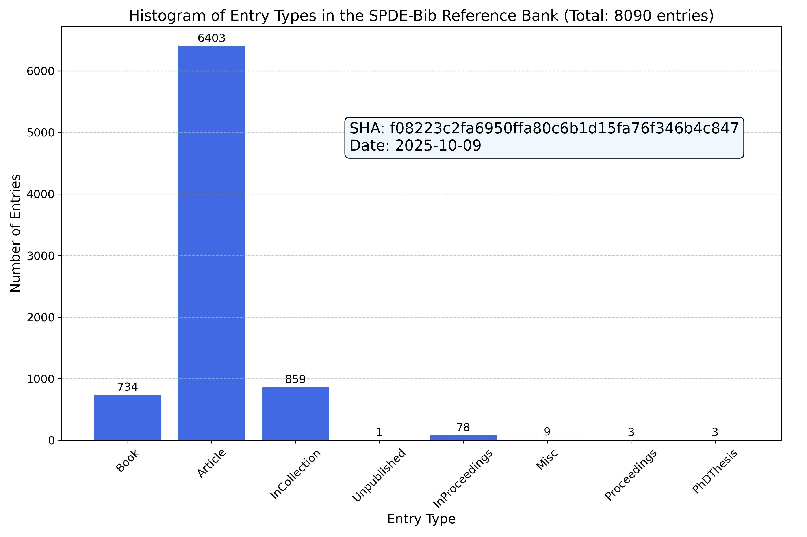

# SPDEs bibliography maintained by [Le Chen](http://webhome.auburn.edu/~lzc0090/)

## Motivation

When writing a paper, it is not an easy task to keep the bibliography part correct and updated. This
process is also very time-consuming. Through this repo, we provide a uniform access to the latest
bibliography entries related to the research area of the author: _Stochastic Partial Differential
Equations (SPDEs)_.



## Demo using nvim

[](https://asciinema.org/a/596819)

* Similar auto completion function exists in [Overleaf](https://www.overleaf.com/).

## The bib file: [All.bib](All.bib).

* A GPT model was created to query the database on Nov. 12th 2023. The results are far from being usable, actually a little disappointed, but you can may some fun to play with it. Here is the [link](https://chat.openai.com/g/g-7ILEucNag-spdes-bib).

## Explanations
1. Most entries downloaded from [MathSciNet](https://mathscinet.ams.org/mathscinet) to keep the
   records consistent.
2. The [BibTool](https://ctan.org/pkg/bibtool?lang=en) is used to generate the citation keys.
  * The convention is two last names separated with period and two digit for year surrounded by :,
      and the first word in the title. For example, `dalang:99:extending`.
3. All references are listed in [All.pdf](All.pdf), check [All.tex](All.tex) for the usage of biber
   to handle the bibliography.
4. There are about 2.6K entries so far.
5. How entries are selected? Here are some general three principles that have been used:
    1. All papers from some authors whose research interest is close to mine are included.
    2. References from some interesting papers, whenever there is a MR number, are included.
    3. References that I come across will be included.
6. [Sample setup using neovim](Sample_setup_using_neovim.md)
7. [All_Numbered pdf](All_Numbered.pdf) is generated by `bib2pdf All.bib All_Numbered.pdf`, where the list of references are listed by numbers.

## How to contribute
1. If you want to include some reference in this bank, you may create an issue or contact me via email
   (chenle02@gmail.com).

## Some other related tools
1. [papis](https://github.com/papis/papis)
2. [bibtex-tidy](https://github.com/FlamingTempura/bibtex-tidy)

## How to contribute?

If you use this bank and want to include some entries, please let me know. I will add them to the bank.

# Acknowledgments

We hope that the resources compiled in this bibliography bank have been supportive in your research endeavors. We are sincerely grateful for any form of acknowledgment you might extend. Should you wish to mention this work, a statement such as the one below could be included in your acknowledgments section or as a footnote:

```
  The author(s) would like to recognize the contribution of the GitHub
  repository chenle02/SPDEs-Bib curated by Le Chen, which has supported this
  research.
```

Or, if you prefer to directly cite this repository, please feel free to use the following BibTeX entry:
```bibtex
@misc{chen:22:spdes-bib,
  author       = {Chen, Le},
  title        = {SPDEs-Bib: A Comprehensive Bibliography of Stochastic Partial Differential Equations and Related Topics},
  year         = {2022},
  publisher    = {GitHub Repository},
  howpublished = {\url{https://github.com/chenle02/SPDEs-Bib}},
  note         = {Accessed: 11/11/2023, V1.0},
}
```

Your support in recognizing the effort put into compiling and maintaining this repository is much appreciated.

## License

[CC-BY-SA 4.0](LICENSE.txt)
